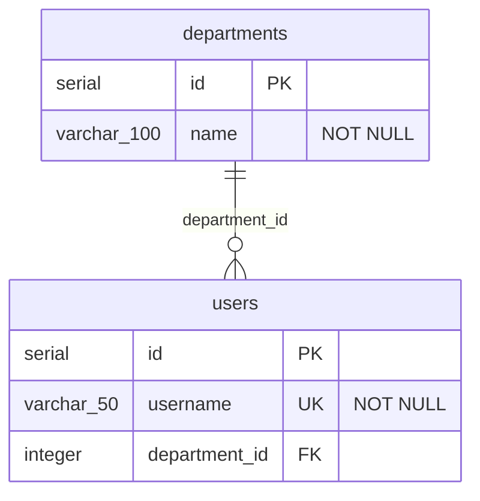

# flyway2mermaid

[](https://github.com/navikt/flyway2mermaid/actions/workflows/ci.yml)
[](https://opensource.org/licenses/MIT)

A GitHub Action that generates [Mermaid ER diagrams](https://mermaid.js.org/syntax/entityRelationshipDiagram.html) from [Flyway](https://flywaydb.org/) SQL migration files.

## GitHub Action

```yaml
name: Update ER diagram

on:
  push:
    branches: [main]
    paths:
      - "src/main/resources/db/migration/**"

jobs:
  diagram:
    runs-on: ubuntu-latest
    permissions:
      contents: write
    steps:
      - uses: actions/checkout@v6

      - uses: navikt/flyway2mermaid@v1
        with:
          migrations: src/main/resources/db/migration
          direction: LR
          commit: true
```

The action reads your Flyway migrations, generates a Mermaid ER diagram, and optionally posts it as a job summary and/or commits it to the repository.

### Inputs

| Input            | Default                            | Description                                                            |
| ---------------- | ---------------------------------- | ---------------------------------------------------------------------- |
| `migrations`     | _(required)_                       | Path to Flyway migration directory                                     |
| `output`         | `docs/schema.mmd`                  | Output file path                                                       |
| `direction`      |                                    | Diagram direction: `TB` (top-bottom), `BT`, `LR` (left-right), or `RL` |
| `summary`        | `true`                             | Post diagram as GitHub Actions job summary                             |
| `commit`         | `false`                            | Commit the generated diagram to the repository                         |
| `commit-message` | `chore: update Mermaid ER diagram` | Commit message when `commit` is enabled                                |

### Outputs

| Output    | Description                |
| --------- | -------------------------- |
| `diagram` | Path to the generated file |

> [!NOTE]
> The `commit` option requires `contents: write` permission. The commit is skipped if the diagram hasn't changed.

## Example

Given these migration files:

**V1\_\_create_departments.sql**

```sql
CREATE TABLE departments (
    id SERIAL PRIMARY KEY,
    name VARCHAR(100) NOT NULL
);
```

**V2\_\_create_users.sql**

```sql
CREATE TABLE users (
    id SERIAL PRIMARY KEY,
    username VARCHAR(50) NOT NULL UNIQUE,
    department_id INTEGER REFERENCES departments(id)
);
```

The action generates:



## Supported SQL

| Statement                       | Support                               |
| ------------------------------- | ------------------------------------- |
| `CREATE TABLE`                  | ✅ Columns, types, inline constraints |
| `ALTER TABLE ADD COLUMN`        | ✅                                    |
| `ALTER TABLE ADD CONSTRAINT`    | ✅ PK, FK, UNIQUE                     |
| `DROP TABLE`                    | ✅                                    |
| `PRIMARY KEY`                   | ✅ Inline and table-level             |
| `FOREIGN KEY` / `REFERENCES`    | ✅ Inline and table-level             |
| `NOT NULL`, `UNIQUE`, `DEFAULT` | ✅                                    |

## Diagram layout

Tables are sorted topologically by importance — the most referenced tables appear first, giving Mermaid's layout engine better hints for positioning. Use the `direction` input to control the overall flow (`LR` often produces more compact diagrams).

## CLI

The tool can also be used standalone:

```bash
npx @navikt/flyway2mermaid src/main/resources/db/migration -o docs/schema.mmd --direction LR
```

## Contributing

Contributions are welcome! See [CONTRIBUTING.md](CONTRIBUTING.md) for guidelines.

## License

[MIT](LICENSE)
