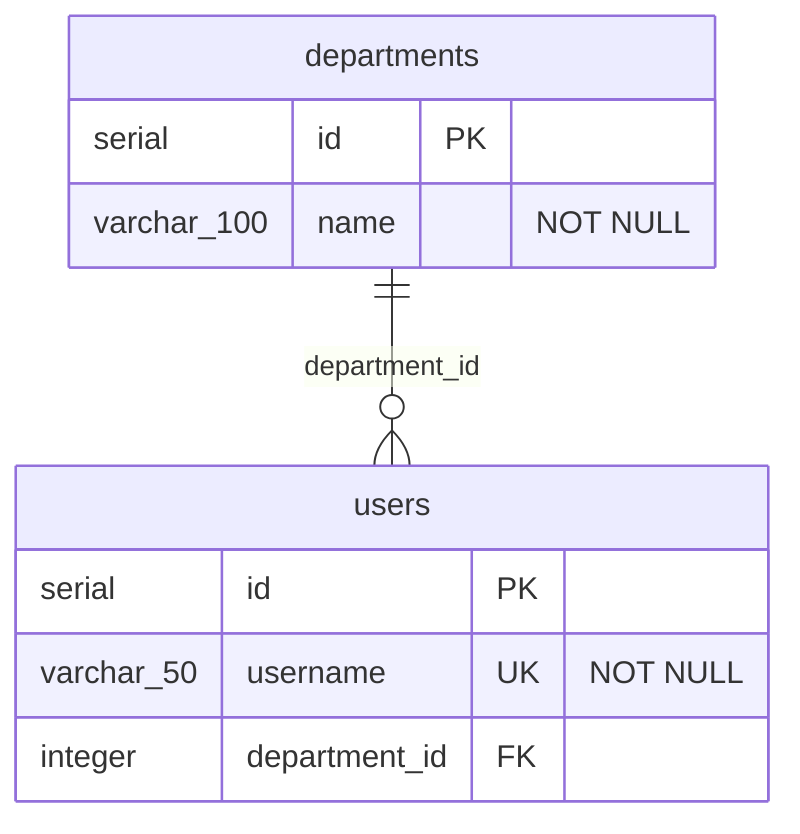

# flyway2mermaid

[](https://github.com/navikt/flyway2mermaid/actions/workflows/ci.yml)
[](https://opensource.org/licenses/MIT)

Generate [Mermaid ER diagrams](https://mermaid.js.org/syntax/entityRelationshipDiagram.html) from [Flyway](https://flywaydb.org/) SQL migration files.

## Features

- Parses Flyway versioned migration files (`V1__create_users.sql`, etc.)
- Supports PostgreSQL DDL (`CREATE TABLE`, `ALTER TABLE`, `DROP TABLE`)
- Detects primary keys, foreign keys, unique constraints
- Generates Mermaid `erDiagram` syntax with correct cardinality
- Pipe-friendly stdout output, ideal for CI/CD pipelines

## Installation

Run directly with `npx` – no install needed:

```bash
npx github:navikt/flyway2mermaid ./migrations
```

Or install globally:

```bash
npm install -g github:navikt/flyway2mermaid
flyway2mermaid ./migrations
```

## Usage

```bash
# Output to stdout
flyway2mermaid ./src/main/resources/db/migration

# Write to file
flyway2mermaid ./migrations -o docs/schema.mmd

# Pipe to a file
flyway2mermaid ./migrations > schema.mmd
```

## Example

Given these migration files:

**V1\_\_create_departments.sql**

```sql
CREATE TABLE departments (
    id SERIAL PRIMARY KEY,
    name VARCHAR(100) NOT NULL
);
```

**V2\_\_create_users.sql**

```sql
CREATE TABLE users (
    id SERIAL PRIMARY KEY,
    username VARCHAR(50) NOT NULL UNIQUE,
    department_id INTEGER REFERENCES departments(id)
);
```

Running `flyway2mermaid ./migrations` produces:



## GitHub Action

The easiest way to keep your ER diagram up to date. Add this to your workflow:

```yaml
name: Update ER diagram

on:
  push:
    branches: [main]
    paths:
      - "src/main/resources/db/migration/**"

permissions:
  contents: write

jobs:
  diagram:
    runs-on: ubuntu-latest
    steps:
      - uses: actions/checkout@v4

      - uses: navikt/flyway2mermaid@v1
        with:
          migrations: src/main/resources/db/migration
```

That's it! The action generates the diagram, and if it changed, commits and pushes `docs/schema.mmd` automatically.

To display the diagram in your README, add:

````markdown
```mermaid
erDiagram
```

<!-- Or link to the file: -->

[View ER diagram](docs/schema.mmd)
````

### Action inputs

| Input            | Default                             | Description                        |
| ---------------- | ----------------------------------- | ---------------------------------- |
| `migrations`     | _(required)_                        | Path to Flyway migration directory |
| `output`         | `docs/schema.mmd`                   | Output file path                   |
| `commit`         | `true`                              | Commit and push the diagram        |
| `commit-message` | `docs: update ER diagram [skip ci]` | Commit message                     |

### Action outputs

| Output    | Description                       |
| --------- | --------------------------------- |
| `diagram` | Path to the generated file        |
| `changed` | `true` if the diagram was updated |

### Advanced: generate without committing

```yaml
- uses: navikt/flyway2mermaid@v1
  id: erd
  with:
    migrations: src/main/resources/db/migration
    commit: "false"

- name: Upload as artifact
  if: steps.erd.outputs.changed == 'true'
  uses: actions/upload-artifact@v4
  with:
    name: er-diagram
    path: ${{ steps.erd.outputs.diagram }}
```

## Supported SQL

| Statement                       | Support                               |
| ------------------------------- | ------------------------------------- |
| `CREATE TABLE`                  | ✅ Columns, types, inline constraints |
| `ALTER TABLE ADD COLUMN`        | ✅                                    |
| `ALTER TABLE ADD CONSTRAINT`    | ✅ PK, FK, UNIQUE                     |
| `DROP TABLE`                    | ✅                                    |
| `PRIMARY KEY`                   | ✅ Inline and table-level             |
| `FOREIGN KEY` / `REFERENCES`    | ✅ Inline and table-level             |
| `NOT NULL`, `UNIQUE`, `DEFAULT` | ✅                                    |

## CI/CD Usage

See [GitHub Action](#github-action) above.

## Programmatic API

```typescript
import { readFlywayMigrations, buildSchema, generateMermaid } from "@navikt/flyway2mermaid";

const migrations = await readFlywayMigrations("./migrations");
const schema = buildSchema(migrations.map((m) => m.sql));
const diagram = generateMermaid(schema);
console.log(diagram);
```

## Publishing

A new version is published automatically when a [GitHub Release](https://github.com/navikt/flyway2mermaid/releases/new) is created. Make sure to update the version in `package.json` before creating the release.

## Contributing

Contributions are welcome! See [CONTRIBUTING.md](CONTRIBUTING.md) for guidelines.

## License

[MIT](LICENSE)
