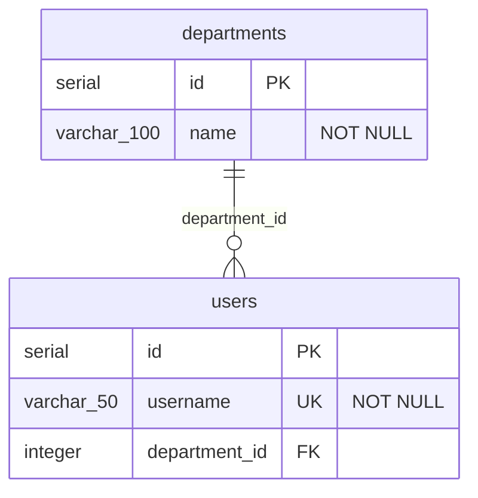

# flyway2mermaid

Generate [Mermaid ER diagrams](https://mermaid.js.org/syntax/entityRelationshipDiagram.html) from [Flyway](https://flywaydb.org/) SQL migration files.

## Features

- Parses Flyway versioned migration files (`V1__create_users.sql`, etc.)
- Supports PostgreSQL DDL (`CREATE TABLE`, `ALTER TABLE`, `DROP TABLE`)
- Detects primary keys, foreign keys, unique constraints
- Generates Mermaid `erDiagram` syntax with correct cardinality
- Pipe-friendly stdout output, ideal for CI/CD pipelines

## Installation

The package is published to [GitHub Packages](https://github.com/navikt/flyway2mermaid/packages). To install, first configure npm to use the GitHub registry for the `@navikt` scope:

```bash
echo "@navikt:registry=https://npm.pkg.github.com" >> .npmrc
```

Then install:

```bash
npm install -g @navikt/flyway2mermaid
```

Or use directly with `npx`:

```bash
npx @navikt/flyway2mermaid ./migrations
```

### CI/CD usage

In GitHub Actions, no extra auth is needed – `GITHUB_TOKEN` has read access to packages in the same org. Add this to your workflow:

```yaml
- uses: actions/setup-node@v4
  with:
    node-version: 22
    registry-url: https://npm.pkg.github.com

- name: Generate ER diagram
  run: npx @navikt/flyway2mermaid ./migrations -o docs/schema.mmd
  env:
    NODE_AUTH_TOKEN: ${{ secrets.GITHUB_TOKEN }}
```

## Usage

```bash
# Output to stdout
flyway2mermaid ./src/main/resources/db/migration

# Write to file
flyway2mermaid ./migrations -o docs/schema.mmd

# Pipe to a file
flyway2mermaid ./migrations > schema.mmd
```

## Example

Given these migration files:

**V1\_\_create_departments.sql**

```sql
CREATE TABLE departments (
    id SERIAL PRIMARY KEY,
    name VARCHAR(100) NOT NULL
);
```

**V2\_\_create_users.sql**

```sql
CREATE TABLE users (
    id SERIAL PRIMARY KEY,
    username VARCHAR(50) NOT NULL UNIQUE,
    department_id INTEGER REFERENCES departments(id)
);
```

Running `flyway2mermaid ./migrations` produces:



## Supported SQL

| Statement                       | Support                               |
| ------------------------------- | ------------------------------------- |
| `CREATE TABLE`                  | ✅ Columns, types, inline constraints |
| `ALTER TABLE ADD COLUMN`        | ✅                                    |
| `ALTER TABLE ADD CONSTRAINT`    | ✅ PK, FK, UNIQUE                     |
| `DROP TABLE`                    | ✅                                    |
| `PRIMARY KEY`                   | ✅ Inline and table-level             |
| `FOREIGN KEY` / `REFERENCES`    | ✅ Inline and table-level             |
| `NOT NULL`, `UNIQUE`, `DEFAULT` | ✅                                    |

## CI/CD Usage

See [Installation → CI/CD usage](#cicd-usage) above for a complete workflow example.

## Programmatic API

```typescript
import { readFlywayMigrations, buildSchema, generateMermaid } from "@navikt/flyway2mermaid";

const migrations = await readFlywayMigrations("./migrations");
const schema = buildSchema(migrations.map((m) => m.sql));
const diagram = generateMermaid(schema);
console.log(diagram);
```

## Publishing

A new version is published automatically when a [GitHub Release](https://github.com/navikt/flyway2mermaid/releases/new) is created. Make sure to update the version in `package.json` before creating the release.

## License

MIT
