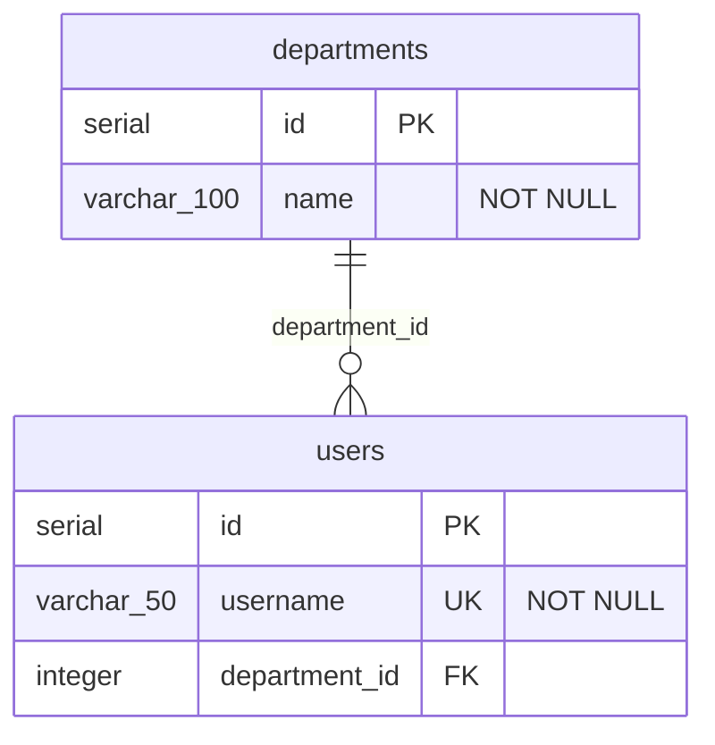

# flyway2mermaid

[](https://github.com/navikt/flyway2mermaid/actions/workflows/ci.yml)
[](https://opensource.org/licenses/MIT)

A GitHub Action that generates [Mermaid ER diagrams](https://mermaid.js.org/syntax/entityRelationshipDiagram.html) from [Flyway](https://flywaydb.org/) SQL migration files. The diagram is uploaded as a build artifact.

## Quick start

Add this workflow to your repository:

```yaml
name: Update ER diagram

on:
  push:
    branches: [main]
    paths:
      - "src/main/resources/db/migration/**"

jobs:
  diagram:
    runs-on: ubuntu-latest
    steps:
      - uses: actions/checkout@v4

      - uses: navikt/flyway2mermaid@v1
        with:
          migrations: src/main/resources/db/migration
```

That's it! When migrations change, the action generates a Mermaid ER diagram and uploads it as the `er-diagram` build artifact.

## Example

Given these migration files:

**V1\_\_create_departments.sql**

```sql
CREATE TABLE departments (
    id SERIAL PRIMARY KEY,
    name VARCHAR(100) NOT NULL
);
```

**V2\_\_create_users.sql**

```sql
CREATE TABLE users (
    id SERIAL PRIMARY KEY,
    username VARCHAR(50) NOT NULL UNIQUE,
    department_id INTEGER REFERENCES departments(id)
);
```

The action generates:



## Inputs

| Input        | Default           | Description                        |
| ------------ | ----------------- | ---------------------------------- |
| `migrations` | _(required)_      | Path to Flyway migration directory |
| `output`     | `docs/schema.mmd` | Output file path                   |

## Outputs

| Output    | Description                |
| --------- | -------------------------- |
| `diagram` | Path to the generated file |

## Advanced: custom output path

```yaml
- uses: navikt/flyway2mermaid@v1
  with:
    migrations: src/main/resources/db/migration
    output: schema.mmd
```

## Supported SQL

| Statement                       | Support                               |
| ------------------------------- | ------------------------------------- |
| `CREATE TABLE`                  | ✅ Columns, types, inline constraints |
| `ALTER TABLE ADD COLUMN`        | ✅                                    |
| `ALTER TABLE ADD CONSTRAINT`    | ✅ PK, FK, UNIQUE                     |
| `DROP TABLE`                    | ✅                                    |
| `PRIMARY KEY`                   | ✅ Inline and table-level             |
| `FOREIGN KEY` / `REFERENCES`    | ✅ Inline and table-level             |
| `NOT NULL`, `UNIQUE`, `DEFAULT` | ✅                                    |

## Contributing

Contributions are welcome! See [CONTRIBUTING.md](CONTRIBUTING.md) for guidelines.

## License

[MIT](LICENSE)
